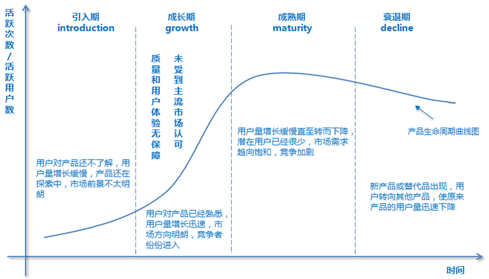

## 从有限的物质世界飞跃到无限的思想空间

如果明天早上你不会醒来，今天你会做些什么呢？

## 不做伪工作者

**愿你在工作之余还能有时间欣赏身边的风景。**

善于找到最重要的工作，并且优先完成它们 —— 为自己的工作列优先级：
- 动脑筋去思考，做什么事情能让公司最大获益，而不是简单应付老板派下来的工作，向老板交差。
- 做什么事情可以提升自身能力？

## 10000小时定律

**智商、10000小时、运气和家庭环境，这些都是成功的必要条件，但没有一个是充分的，甚至加到一起也不充分。**

简单地重复失败是永远走不出失败的怪圈的：若想成功是失败之母，必须从之前的成功和失败中吸取教训。
- CEO的眼界、格局、识人和用人能力，决定着一家公司能否成功。
- 期待一流的团队，对傻逼零容忍（based on公司优秀的人才制度）。

凡事要习惯回过头来三思。
+ 是否我错了，他对了，这一遍思考，一定不能假设自己是对的。
+ 如果还是觉得自己对，对方错，要想是否我的境界不够，不能理解他。

离开自己的舒适区：当一种技能稍微熟悉了，你需要做一件新的有挑战的事情，以便达到下一个目标。

## 人类是否能够长生不老

克隆人的伦理学问题：小明经过克隆，得到小小明，那问题来了，小明的老婆小美，是不是小小明的老婆呢，晚上他们要不要一起睡觉？

所谓长生不老，就是活得长，而且直到生命的最后，依然健康 —— **嗯嗯，健康非常重要，减肥！**

## VR技术与“第三眼美女”

IT新产品获得市场认可必经的三个阶段。
+ 虽然有了一个革命性的发明，产品很性感，但是毛病很多，只有对技术特别敏感的人才会关注和使用。
+ 解决了第一阶段大部分问题，让技术带来的好处充分显现出来，但是价格昂贵，有时还不好伺候，因此只有有钱人才会使用。
+ 解决了价格问题，才能普及到大众。

Product Life Cycle.

## 如何判断技术和产品是否有前景？“黄赌毒开道”

黄、赌、毒是人的最基本需求，哈哈，陌陌、摇一摇、漂流瓶等。人类本能的欲望不会随着素养的提高、受教育程度的增加而消失，只会暂时隐藏起来，或者在权衡利弊后忍痛割爱放弃掉。王欣深谙此道，出狱之后做马桶MT。

黄、赌、毒分别指色情网站、在线赌博和非法交易。

## 说说蚂蚁（小公司）如何战胜大象（大公司）

洋枪洋炮对大刀长矛。
+ 有一个杀手功能，没有杀手锏什么都免谈。
+ **顺势而为**：小蚂蚁的杀手锏必须容易得到当时相关技术的帮助，以至于进步飞快，而传统的产品难以受益于当时的技术进步。

## 从《孙子兵法》和《战争论》说起

**目标的可操作性**在管理公司上的重要性 —— 使成功可以被复制。
+ “重视产品质量” vs. “将程序的单元测试覆盖率由目前的5%，提升到50%”。
+ 为了达到目标，需要具体可操作的步骤，如代码没有单元测试就不能提交，写单元测试超过80%，就给发一笔奖金等等。

目标不仅需要具备可操作性，还要可以被量化，用于判断目标完成的百分比。

## 把公司大小之争变成新旧时代之争

**雄心壮志好青年(候选人) vs. 老奸巨猾大忽悠(小创业公司CEO) —— 星爷篇**

> 大忽悠：公子，你还真识货哎，这么多船，你偏偏挑中我这艘船，我可是出了名的快啊。

> 好青年：是吗？

> 大忽悠：当然啦~

> 好青年：哎呦，卧槽，你的船在下沉嘞~

> 大忽悠：我不是说过咯，沉也沉的快嘛~

如何体现小创业公司的快，尤其是互联网创业公司？ —— 灵活：迅速组织团队，利用各种便捷资源（如开源软件），很快投入到新产品的研发中。

船的龙骨是什么？ —— 使命、愿景和价值观！
+ 在公司成立之初，一定要树立正确的价值导向。**身为软件研发部负责人，刷着论坛，拿着高工资，划水划的飞起，公司竟然能容忍这种人活到现在，搞啥搞，日你仙人板板！**
+ 企业或团队文化成型之前，尽量不要招聘新员工；成型之后，将扩张规模控制在原始团队规模的1/3以内。**卧槽，大姐和小苏在船上凿了个大洞，麻蛋，你们是大疆派过来的间谍吧！**

## 期望值最大化原则和它在生活上的应用

在一个公司里，创始人定下一个什么样的价值观（收益函数），员工就会不自觉地朝着收益最大化的方向努力。
+ Google从小公司开始，给单元测试写得好的员工发奖金，给代码经常出错的员工小惩戒，于是它自然而然地发展成一个重视工程质量的公司。
+ 论坛刷的飞起，APP和测试团队管理的一塌糊涂，工资比我高，还不受任何惩罚，我为啥要努力工作呢？

## 有小聪明没有智慧的人

在未来，制造智能机器的人，其实在利用机器控制其他人。抢月饼这件事，不是机器在和人抢，是有人利用机器在和那些没有使用机器的人抢，“胜负”显而易见。善用机器智能的公司，一定会在竞争中胜出；拒绝机器智能的，一定被淘汰，这是大势所趋。**善用新技术，让自己/组织具备竞争优势。**

勿以恶小而为之，不论大小，恶就是恶。

即便耍小聪明不伤害到公司的利益，也是不要做为好，因为这让一个人变得胸无大志，鼠目寸光。
+ 影响你在别人心目中的看法：公司每天下午的免费水果，汉堡事件，麻蛋，耻辱！

## 西瓜与芝麻

人一旦心态变得非常低，渐渐习惯于非常低的追求，就很难提升自己，让自己走到越来越高的层次上来。

专注于做好一件事/一款产品。
+ 雅虎开发出的互联网服务多得不得了，数都数不过来，但没有一个是世界第一的，很多服务流量和盈利能力非常有限，都是一些小芝麻，最后加起来，还不如Google一个产品带来的收入高。很多公司看到别人挣了钱，自己也要涉足那个行业，最后分到芝麻大一点的市场份额，得不偿失，与其这样，不如把自己的专长发挥好。
+ 一个公司拥有1000款产品，与一款产品拥有1000个功能一样，都是极度低能和不自信的表现。

## 便宜的眼泪

松下幸之助：“任何好的商业都必须是能挣钱的，否则就是对人类的犯罪，因为有限的资源可以用于其他地方。”
+ 我们在做任何事情的时候，都必须明确我们的行为所产生的结果，无论从物质上还是精神上讲都是大于（成本）投入的，否则我们对世界的贡献就是负的。
+ 即便是有良好的动机，也不能为负作用开脱，更何况动机的好坏很难判定。

*从这个角度上来讲，不作为和好心办坏事，都是对世界的犯罪。*

## 关于美国大选答万维钢老师提问

自由 vs. 平等 —— 自由和平等是矛盾的。
+ 如果一个国家是完全自由的，因为人的能力和运气不同，很快就会出现社会分层，不平等了。
+ 如果强调绝对的平等，人就没有了自由。**我的理想是让这个国家不平等，并为之付出努力，这是我的自由。**

莎翁：“倾听别人的意见，但是保留你的判断。”

## 在美国最有钱的人比什么，兼谈美国的慈善文化

钱是为了让孩子做所喜欢的事情，而不是炫富和无所事事的。

## 让你的父母成熟起来

不听老人言，吃亏在眼前？
+ 教育中最可怕的事情就是，用上一辈的思想，教育当下的人，去迎接20年后的未来。
+ 年轻人要让父母理解自己，就要不断将新的思维方式和理念传递给父母。

**建立学习型亲子关系** —— 子女从父母的人生阅历中取其精华，父母学习用新的方式看待世界
+ 父母和子女均可表达对一件事情的观点，以及支持己方观点的论据，但最终选择权归子女，并为自己的选择负责。
+ 无论最终的选择正确与否，均需复盘，从以前的成功和失败中吸取经验和教训。

## 美国私立中学如何教语文和历史

好的教育是能力和素质的教育，通过每一天的课程和课外活动，不知不觉地把好的、适合我们当下社会的**价值观**传递给孩子，同时，让孩子通过知识的学习，掌握分析问题、独立思考和表达自己观点的能力。

吴建民：“软硬都是手段，哪个难？软难。硬，你打我一下我踢你一脚，这个三岁小孩也会，没有难度。讲道理，谈判，软实力，这个很难，首先别人要喜欢你。”

## 担当 —— 走访耶鲁大学随想

人要有自由的思想。
+ 富兰克林：“相信未来，相信年轻人。”
+ 耶鲁是一个向前看的学校，她培养的是未来的领袖，她希望自己的学生按照自己的思想去把握和引领未来，而不希望用老人们的观点禁锢年轻人的思想。因此，即使学校不同意年轻人的做法，也要给他们自由，并且**保护**自己的学生。

**希望你有比我更有见识的想法，我可能会不同意你的观点，但只要你的想法不过激，不太出格，我都会支持你去摸索和尝试。**

**年轻人要有社会的责任感和献身精神。** 在内战期间，耶鲁的一些毕业生回到了自己的故乡 —— 南方各州，当那些州需要有男儿站出来为她战斗时，耶鲁的毕业生应该有这个担当，为自己的故乡战斗，这是大学所鼓励的，即便这些毕业生站到了自己所在州的对立面。

## 像对待家一样对待母校

真正好的教育是：当你离开学校以后，不再需要将（著名）学校的名字挂在嘴边了，因为你的美德和能力说明了一切，否则毕业的一瞬间则是你的人生顶点。

## 硅谷高创会

学什么课不重要，学到什么方法论最重要。
+ 在一个领域中，一个二流的人一辈子再努力，即便在自己的领域里可能也进不了一流的行列。
+ 很多一流的人进入另一个领域常常还是一流，这里的差距不在于智力和努力程度，而在于做事情的思想方法。

*一名傻缺高级项目管理总监，也不会是一名优秀的清洁工。*

## 巴菲特午餐都聊些什么

不要做自己不懂的事情。
+ 不做自己不熟悉的事情，只是不做当下自己不熟悉的，并非永远不打算熟悉那些事情 —— 巴菲特对英特尔、IBM和苹果的投资。
+ 对于大部分人来讲最好的投资是自己的工作和事业，因为你擅长于此。

**智慧大战之步步高篇** —— 步步高每年投入几十亿做广告，让广告公司挣得盆满钵满

> 步步高高管团队：小平童鞋啊，咱们可以自己创办广告公司呀，或者收购一个，自己搞，别便宜了那帮畜生啊~

> 段永平：你们这帮脑残，你们懂做广告吗，劳资都不懂，你们多啥？

> 步步高高管团队：别怂啊，老铁，你怎么就知道特么我们搞不好，我们现在不懂，但是可以学啊。

> 段永平：学你妹夫，如果你们的狗屁逻辑是对的，那现在世界上最大的广告公司一定是可口可乐广告公司和宝洁广告公司，我们还用得着去CCAV做广告吗？一群傻逼，给劳资爬~

巴菲特认为，懂得投资艺术的人非常少。用巴菲特的这种思路梳理一下自己周围的小伙伴们，发现真特么正确，无论是懂得产品艺术、营销艺术还是管理艺术的人，都是极少数。**就凭这一群无耻之徒，有功就抢，有锅就甩，为啥你认为可以同时做好云台相机和无线摄像头？**

## 这个世界没有欠你什么

不要指望通过十年寒窗苦读就一下子翻身，醒醒，兄弟，想啥呢，现实点好伐。
+ 社会竞争是一种非常复杂的长期系统性动员，寒窗苦读只是成功的因素之一，钱多、智商高、读书强、父母好、长得美都是其中的一个变量而已，命运是多个变量互动的结果。
+ 不要因为自己很努力，就特么觉着别人不努力。**小聪聪家境好吧，可以混吃等死吧，别人读书的时候也是很努力的好伐~**
+ 在任何国家，历朝历代，社会都是分层的。稍微好一点的社会，不过是有一个上下层之间的通道，让人员可以流动而已。*认清这个残酷的现实，才有一点点希望，感谢伟大的互联网吧，骚年们！*
+ 对于那些试图在金字塔上爬几个台阶的人来讲，重要的不是抱怨社会的不公平（社会本来就不公平），而是付出足够的努力，同时把注意力放到最应该关注的事情上去。

啥叫公平？麻痹的，劳资天天努力工作，读书旅行提升自己，用正确的价值观养育子女；你麻痹的整天刷论坛，想着溜须拍马和甩锅，劳资儿子凭啥和你儿子一样的待遇？想啥呢？

## 帝道、王道与霸道，兼谈博雅教育

**欲速则不达 —— 不要试图用短期的方法，达成长期的目标。**

但凡能够比较长期稳定挣钱的行业，开始的投入都是比较大的，并不存在一种不需要投入就能获得很高回报的行业（达内？），否则，这个行业一定太挤（谁傻啊，培训3个月，月薪过万，阿猫阿狗都来了，傻逼都能做项目经理，对吧？！），以至于一段时间后行业的回报会急剧下降。

## 引擎和刹车

在一个和谐的社会里，有动力的人应该成为引擎，有经验的人应该成为刹车。 —— **在一家公司里，谁应该扮演引擎，谁又应该扮演刹车呢？**

CMU的一个毕业生在毕业典礼上问主讲嘉宾盖茨，下一个像微软这样的机会在哪里？盖茨说，这是我该问你的问题。像盖茨这样的智者，很清楚什么事情不能做，但是他希望年轻人提出什么事情能做，这样才能突破老一代的思维局限性。
+ 盖茨的内心活动：麻痹的，你问的是个锤子，劳资要是知道，早去干了，还跟你在这儿哔哔~

## 五级工程师和职业发展

人和人的差距，能力和能力的差距，是数量级的差别，而不是通常人们想象的差一点点。

第三级的工程师 = 第四级工程师 + 对市场的判断力 + 营销能力 + 产品能力 + ...。**我能算是一名合格的第四级工程师吗？**

## 智能时代的产业特点

共享经济：滴滴或Airbnb vs. 上门洗脚、理发。
+ 滴滴和Airbnb通过互联网把更多的（闲置）资源引入了市场，让大家共享。
+ 上门洗脚则不同，不能因为有了共享经济的概念就多出了几倍的洗脚妹，有闲暇时间的人一般也不可能端着个盆给人上门洗脚。原来是多少资源还是多少资源，所谓搞分享经济的公司，无非是再扒一层皮而已。

## 约翰·霍普金斯大学的黑科技2:人工心脏

做什么事情才是有意义的 —— 工作的选择标准？
+ 感受人间疾苦，解决现有问题：非洲专用婴儿温箱、人工心脏、迅雷等。
+ 改变世界型：今天，我们重新定义了xxx.

## 阿拉斯加日记

做一件事情，要把富裕量留的足够多 —— 赶飞机、买股票等。
+ 对一件耽误不起的事情，最后半个小时的时间不是你的，是上帝的。

## 阿拉斯加日记2：听书分享 —— 《做条狗》

承认和正视人和人之间的差距，珍视上天给我们每一个人的天赋，扬长避短（而不是补短）。
+ 我们显然不会努力练习掌握狗一样的嗅觉，或者训练狗像我们一样善于识别图像，因为那都是很荒唐的。同样的道理，**我们不必要刻意地模仿谁，从而迷失了自我**。
+ 我们也不应该把自己的模式套到别人的身上，不能认为自己能做到的，别人就必须做到；反之亦然，我们自己做不好的，别人可能做得非常好。

在公司里，如何对待论坛、牛逼和犹大？
+ 消除自身的攻击性，我只是对他们的做事方式和态度等有不同意见。
+ 我能够理解他们为什么这么做，毕竟一群老逼，没几天蹦跶了，但是我不赞同，更不会效仿。
+ **要不要公开地把自己的想法说出来，要！不说的话，公司大概率会维持老样子，我肯定会离开。既然要离开，为啥要惯着他们这群老逼，说！**

## 人类还太年轻 —— 一年与半小时

有些时候，是要装点糊涂的。**装糊涂才能宽容人，宽容人才能得人心，得人心才能得天下**。
+ 对于很多事情，我们需要宽容，需要用和平的方式解决问题。宽容不仅对别人有好处，也能让我们自己身心少受到毒素伤害。
+ 我们要每时每刻采取行动，改变那些不合理的现象。我们应该做得多，抱怨得少，因为抱怨不解决问题，行动才解决问题。 —— 看不惯？说啊，有啥大不了的？！

## 几何学和罗马法

**（公司）积累与传承** —— 无论是古埃及还是美索不达米亚，文明开始的时间都早于古希腊，它们很早就了解到了数学上的很多结论，比如勾股定理。但是这些零散的数学知识不能形成体系，因此后人很难在前人的基础上继续进步。

**法律制度/公司条例在时间和空间上的普遍性** —— 《秦律》非常有目的性，非常功利，并不讲究内部的逻辑性，仅仅是为了帮助秦国统一天下。不仅《秦律》如此，东方古国的法律都有这样的特点，即完全是为了维护一时的统治需要，而不是从正义出发自然演绎的结果。

## 波士顿艺术博物馆

高更的巨作《我们从哪里来？我们是谁？我们向何处去？》画面充满了神秘的气息，看上去表现的是原始质朴的生活和美丽的自然景观，但他的目的是想表达他自己寻求人类诞生之初生命本质的想法，以及他对生命意义的追问，这件作品把文明人内心的迷惘、忧伤和焦虑淋漓尽致地表达了出来。

高更把自己对生命本质的思考和对生命意义的追问，倾注到绘画中。*乔布斯是艺术家么，苹果是艺术品吗？***我呢，我对人性和生活有思考吗，我要在什么地方体现这些思考呢？**

## 在米其林三星餐厅能吃到什么

一家轮胎公司为什么要搞餐厅评级呢？因为十九世纪末，汽车刚刚开始起步时，大家除了通勤，并不知道它还能干什么。当时在法国创办米其林轮胎公司的米其林兄弟就开始琢磨怎样拓展汽车的用途，汽车开的里程多了，轮胎自然也就卖得多。

这兄弟二人后来想到，何不编一本旅游餐饮指南，鼓励大家开着汽车去吃喝玩乐呢？于是，趁着1900年巴黎举办世界博览会，米其林就将地图、加油站、旅馆、餐馆等凡是能够帮助汽车旅行的信息收集成书。当然，米其林是为了卖轮胎，而不是餐饮指南，因此他们出版的《米其林指南》一书以免费的方式提供给客户。

## 商业的本质是让人多花钱，而不是省钱

**当网购节省了我们大量的时间，给我们提供了越来越便宜的商品之后，我们多出来的时间和金钱应该拿来干什么？** 把时间用来学习提高自己？把钱攒起来，或者拿来投资？这是很多人都会说的、非常理性的想法，但是绝大多数人实际上不会这么做。他们会把钱花掉，会把时间拿来享乐，这不是人有没有志向的问题，而是人性使然。

从线下到线上，再从线上到线下：
+ 人在满足了衣食住行等基本需求后，常常会追求娱乐和享受，而且随着经济水平的提高，这种需求会越来越强烈。
+ 科技的发展可以让我们不需要再去现场就能有身临其境之感。但是另一方面，当我们有了钱和闲暇时间之后，会做相反的事情，从线上重新回到线下，从虚拟世界回到现实世界。

## 销售大师的智慧 —— 把钱收回来

销售的本质 —— 把钱收回来，把钱收回来是要花费成本的。
+ “把东西卖出去”最多只完成了销售的一半，还有另一半，也是最关键的一半，就是“把钱收回来”，否则卖了还不如不卖。
+ 如果我们的目标不再是把东西卖出去，而是把钱收回来，那我们的销售策略就完全不同了，**收款的便捷性**要超过卖出东西的数量。

在生活中，背本趋末的做法时时可见。*很多人不顾家地去挣钱，讲的理由是为了家里的幸福，其实这种做法本身已经让家里不幸福了。*

持续的生意 —— 让顾客把买的东西用光。
+ 一个可持续的生意关键是要让顾客把买的东西花光，否则就很难让他们第二次、第三次购买。

在Google，一个员工每一次升迁之后，得到大笔奖励的同时，之前全部的贡献就被清零了。下一次升迁，所依据的贡献要从前一次升迁后算起，而不是历史上全部的贡献。这就防止了一些人靠运气搞出个非常成功的产品后，躺在上面吃一辈子的情况。

## 销售大师的智慧2：商品和服务要让消费者有面子

装逼（有面子）是刚需。
+ 任何行业都是有鄙视链的，苹果看不起华为，华为看不起小米，连编程语言都有鄙视链，哈哈...

## 莎士比亚的智慧

莎翁的人生智慧：
+ 凡事三思而行，不要想到什么就说什么。 —— **为人做事要持重**，要多动脑筋，不要毛毛躁躁。
+ 对人要和气，但不要过分狎昵。 —— 很多时候，礼数有加，但保持距离，是朋友之间最好的交往方式。
+ 相知有素的朋友，应该用钢圈箍在你的灵魂上，可是不要对一个泛泛的新知烂施交情。 —— 一个人因为交往的带宽有限，因此不可能和所有人交情都很深，一个表面上对所有朋友一视同仁的人，实际上是很难有至交的。

我过去有一个非常不成功的老板，当年是一个专业能力颇强的新锐。因为他做事情无私心，老局长很喜欢他，就提拔他。这位老板是一个好好先生，对所有部下一视同仁，他自己觉得这很公平。但是不到两年，所有能干的部下全跑光了，他手下剩的都是平庸之辈，他一点业绩也做不出来，于是很早就退休赋闲了。

**不要给损友第二次机会，永远不要来往**。
+ 我对人，一般都先假设他是正直、善良和诚信的，当然，我有很大的机会上当，不过没有关系，我只会上一次当，因为不给人第二次机会。
+ 你可能会问，这样一来，是否会错失很多本来能够成为朋友的机会，因为人是会改变的啊，他可能会变好啊。是的，人确实会变好，但是已经与我无关了。

## 瑞士制造的智慧 —— 做好最后的1%

“我们已经走了九十九步，为什么不把最后一步走完呢？” —— 一定要把事情的最后一步做好！

## 2016年总结

大多数创业成功的人，都是经过了深思熟虑后，利用原有单位的条件和自己现在的职务之便，把创业的准备工作做充分了，东西做的差不多了，再出来创业。 —— **陌陌**？

## 拉斯维加斯的消费电子展2：人工智能技术

产品设计的基本原则 —— 能否解决人们日常生活中的部分问题？
+ 机器人和人一样，重要的是脑子而不是四肢，真正有意义的机器人是要能够解决人的问题，而不是长的像人。
+ “小冰” and “小Q” = 展示一下技术的玩具，这一类的原型几十年前就有，今天换一种技术，换一种形态出现，依然摆脱不了玩具的定位。

## 拉斯维加斯的消费电子展1：七年之痒

要对市场做出正确反应，而不是预测市场 —— **市场是在不断变化的，准确预测是非常难的事情**。

## 向死而生

爱因斯坦：我们对死亡的恐惧有点莫名其妙，我们站在“有”的世界，试图理解“无”的问题，按照“有”的逻辑，对“无”产生恐惧。

除死无大难：
+ 每当遇到困难、挫折和失败，我就想，没关系，我还活着，活着就有希望。
+ 活着总要做些事情，但是考虑到最终要死掉，并没有时间什么事情都做 —— 把要做的事情，从最重要的开始，列一个单子，就尽量开始做了。
+ 死亡是人对社会的最后一次贡献。

*想那么多干啥，害怕你就不死吗，活着的时候开开心心的，做好每一件重要的事情，争取给社会留下点什么，死就死呗，有啥大不了的~*

## 拉斯维加斯的消费电子展3：未来汽车

做任何一件事情，**目的性要明确**，首先确定自己要通过这件事情达成什么目标，再选择一个合适的实现方案，努力实现此目标。

## 司马迁的智慧 —— 东方最早的经济学综合论文《货殖列传》

一个从教育，管理再到商业普遍适用的原理 —— “故善者因之，其次利道之，其次教诲之，其次整齐之，最下者与之争。”

## 撒切尔夫人的智慧

为什么要向穷人收税呢？撒切尔夫人的解释是，一个公民只有交了税，哪怕只交五块钱的税，那么他就会觉得自己是这个国家的主人，才会关心这个国家。否则，他就会觉得像是在住旅馆，这个国家的好坏和他半点关系没有。**如何让员工觉着，公司的命运与自己休戚相关？**

一个保守主义者，可能在外人看来没有那么远大的理想，但是他们会从眼前做起，从小事做起，通过一种渐变的方式改变自己的命运，改进周围的环境。

## 特朗普为什么不追究希拉里

我们在生活中，其实也不必以一定要证明自己正确为原则，而应该多考虑如何对自己有利。**迪少：保障自己的利益，是做任何事情的第一原则。**

## 赵小兰为什么能当上部长 —— 谈谈讲理的方法

以子之矛，陷子之盾：
+ 观点非常旗帜鲜明，没有那种“既要......，又要......”和稀泥的废话逻辑，在批评一些人时毫不避讳。
+ 如何在明确表达自己观点的同时，又不引起对方反感？语气平和，像讲故事一样讲理。
+ 肯定和认同对方的观点，但是用事实说明你们的作为违背了你们的观点。

*夸自己时，要做到理直气壮，特么劳资就是做的比论坛好，有啥不能说的；批评别人时，要做到委婉和心平气和，各种依据一定要站得住脚，那劳资是不是可以随便怼论坛了？*

## 我们靠什么服人1：从日心说的公案说起

事实比口才更重要 —— 在工作中，当我们有了一个好的想法时，要想说服老板，不是去靠和他吵架，也不是靠巧舌如簧，而是拿出不可辩驳的事实，因为任何人都难以无视事实。

## 我们靠什么服人2：从进化论的公案说起

如何让基督教会接受达尔文的进化论？
+ 赫胥黎并不是全面否定宗教，只是反对宗教里落后的思想。要知道直到今天接受基督教思想的不仅是教会本身，还有几十亿的教徒呢，因此反对神创论不能全面否定基督教。
+ **攻其弱点**：不能因反对而反对，要给出逻辑严谨的证明，用事实说话，必要的时候，还要举个栗子~
+ 调动资源，寻找自己的同盟军，当然，不能找论坛这样的猪队友哈~

## 国联失败了而联合国却办成了 —— 罗斯福的大智慧

利用人们的心理特点，把握好时机，让大家主动来接受你的想法，而不是强制把自己的想法推销给各方。

## 澳大利亚日记2：大堡礁

忙碌不应该是我们生活的目标，它应该是我们获得闲暇的手段，只是我们常常忙碌得忘记了我们为什么要忙碌。

## 我的读书笔记1：我读《哈佛中国史》的一点收获

由粗到细的读书方法：
+ 我最近正在读的书是《哈佛中国史》，总共六本，花了几周时间基本上已经读完了第一遍。个别地方我做了注释，可能会读第二遍。
+ 读书的目的是长智慧（开脑洞），要有选择性的读书，就跟与人聊天一样，你特么整天和论坛聊天，丫只会陈述一些事实，没有任何营养，浪费这时间干啥，还不如去打一局游戏。

## 我的读书笔记2：怡情和长智

阿军读书目的的六字诀 —— “怡情、养性、长智”。

每一个人享受的方式不同，这里面没有哪一种就是高雅，哪一种就是低俗的分别。

## 不选择的幸福

对现在的我来说，仅有一个选择是不可能的，我甚至会有10个选择，那我应该怎么办呢？
+ 向死而生，明确自己想要什么，从职业发展、薪资、为社会的贡献、自己所能提供的价值、所做的事情等，甚至是否加班，来衡量所有选择，进而选定一个最终选择。
+ 每个选择的时间跨度要在5年左右，至少要3年以上，时间太短，自己学不到东西，也输出不了什么价值，甚至这件事都不值得去做。
+ 选定之后，持续经营，安心做事，直到遇到不可抗力，或者事情已经做完/做好，才可以有下一个选择。

## 家族财富

在从容的时间里做一件事情，会比在压力下做同样的事情做得好。

## 我们一定比18世纪的人过得好么 —— 兼谈贵族精神

阿军对技术进步的期望：
+ 今天科技进步的结果，应该是让更多的人能够过上优雅而从容的生活，而不是让大家变得没有时间生活。
+ 幸福生活才是根本，其他的不过是达成这个目的的手段而已。

## 我对年轻人第一份工作的建议：不要太在乎工资

杀鸡一定要用牛刀：
+ 对于非常重要的岗位的人，开出一个比市场价高一倍的薪水，这样就是由公司来挑选最好的人，而不是让最好的人在几家公司中做比较了。
+ 对于关键岗位上的人，用一个一流的人和用一个三流的人，结果会大不相同。

## 拉里·佩奇的智慧2：谷歌商业模式的确立

Google的商业模式：将**有用**的信息传达到千家万户，重要的不是产生流量，而是提供有用的内容。

*扩展到橙影的“一键成片”功能，什么用户戳戳戳，什么语音交互，不重要，好伐，重要的是，成片是用户想要的！*

## 拉里·佩奇的智慧1：牙刷和爆款

一个好的产品要有牙刷的功能，让用户每天都必须用上几分钟，就如同刷牙一样，久而久之用户就养成了使用该品牌产品的习惯。由于牙刷是每天都要用的产品，它的**可靠性和稳定性**非常重要，如果它时灵时不灵，哪怕99%的时间是好的，1%的时间不能用，大家都会很烦。

爆款逻辑（持续/每隔一段时间给予用户新鲜感）：
+ 牙刷的功能简单，容易被同类产品替代，尤其是人总是有好奇的心理，一个东西使用的时间长了，总会有尝试新东西的冲动。
+ 一个好的产品或者品牌，每过一段时间就要给大家带来一个惊喜，提醒大家它的存在。

牙刷和爆款逻辑在职场上的应用 —— 每一周，你最好把你的工作总结成三句话，周一早上汇报给你的老板，每半年到一年，你要有一个让他惊喜的成果。

## 如何设计一款好产品

什么是好的产品？
+ 目标必须明确，一定要解决一个特定的问题，这个问题最好不是现有产品已经解决的。
+ 与科学问题不同，工程问题没有绝对正确的答案，只有在当时情况下找最好的方法，即现有技术条件和有限成本条件下可行的解决方案。**对于一个工程师来讲，绝不能等待条件的成熟，而是要尽可能地利用现有技术解决实际问题。**
+ 一切实用的设计都需要有取舍，而取舍的原则都是要围绕最终的目标。
+ 既然要解决新问题，达成新目标，就不要陷入当前产品的固定思维，采用原来的解决方案。

## 在大学做什么

在人生的任何阶段，都只有一个根本，就是“生活”二字，当然，不同年龄段生活的重点不同。

## 如何在二流大学接受一流教育？

在平均水平中等的大圈子里营造出一个精英的小圈子。
+ 在任何一所大学里，都有聪慧贤德之人，而物以类聚，人以群分，只要自己有心向上，自能聚拢一批这样志趣相投的青年人，也自然能加入到他们的行列。

## 常识、科技和艺术

任何事情做到50分靠常识，从50分做到90分靠技术，从90分做到100分靠艺术。每一个阶段是不能跳跃的，做到90分我们通过努力都能达到，至于是否能做得更好，就要看天赋了。
+ 今天新的科学知识，明天就会变成常识，接下来又需要继续向前探索，人类就是这样进步的。
+ *我说总感觉自己搬的砖少了点什么，原来劳资是在追求艺术，哈哈~*

## 卡雷拉斯的谢幕演出

我们在很多时候，总觉得永远有明天，对今天的人、今天的机会并不珍惜，只有在失去后才体会到它们的可贵，而有些则会成为终身的遗憾。

## 投资101（1）：第一堂投资课

投资的行为要围绕目的进行。
+ 发财 vs. 保证财产不受损失（保值或养老） vs. 情怀 vs. 名声。
+ 如果我投资的目的是养老，是否还会在格力电器上涨20%后抛售股票？**为了中长期目标而采取短期行为，是非常愚蠢的**。

## 投资101（3）：投资中的误区

误区 —— 哪怕我买的股票亏了钱，只要我不卖，就没有损失。
+ 一个股市的指数，总有回来的一天，但是对于单个股票就不一定了，**从长远来讲，一个公司难免最后要死的，单个股票早晚要清零**。
+ 个人投资者的最优选项为*沪深300或500指数基金*。

## 投资101（7）：补充介绍几个金融常识

如果你在股市上的策略是玩小聪明，听消息炒作，那么你可能玩不过所谓的庄家，但是你如果长期投入，目标是长期稳定增长，所谓的庄家大户玩什么把戏，和你都完全无关。

## 我的金钱观（上）

饭碗可以跟理想分开。
+ 鲁迅一方面拿国民政府的钱，一方面还骂国民政府，卧槽，干得漂亮！
+ 继续在公司待下去，拿着工资，骂着公司和公司里的一群傻逼，做着自己喜欢的事情，快乐似神仙啊～

## 我的金钱观（下）

如何多挣点钱？
+ 延长工作时间 vs. 提升工作效率 —— 任何能够轻松挣钱的人，都是靠提高单位时间挣钱的效率。
+ 掌握一些大部分人不会的技能，让自己成为稀缺资源。

## 哈佛和斯坦福商学院传授的精髓

玩，混圈子：
+ **精英和普通人的差别不完全在于知识的多少，而在于智慧和人脉**。智慧需要和大师们，和高水平的人在一起切磋才能获得；人脉更是需要从一个好的同学圈子获得，这样将来你们可以互相提携。
+ 在哈佛商学院读书不是上完课，参加一下课堂讨论就完事了，关键在于要和大家一起玩。哈佛商学院有好多各种和玩相关的活动，从暑假到非洲、俄罗斯的旅游，到平时的高尔夫球赛、帆船训练或者酒会等等。

“骗钱” —— 用别人的钱挣钱：
+ 你自己的钱是留给你安身立命的，你如果想做事情，那么就让别人来掏钱。
+ 为了做到这一点，你需要会销售，会把你的产品/想法卖给别人，你的产品/想法也要足够牛逼，获得别人的认可，你的人也要足够的靠谱，让别人乐意掏钱。

## 对话毕达哥拉斯

如果我获得一个绝佳机会，能和雷老板/巴菲特/沐神等交流一个小时，我能和他们聊些什么呢，我想从他们身上获得什么，又能给予他们什么呢？

## 运气的重要性

“天生我材必有用” —— 人总是有运气好的时候和不好的时候。
+ 人在运气不好的时候，最需要的不是盲目的努力，而是耐心。
+ 在成功时，感谢帮助过自己的人，感谢上天安排的命运，而不是过分强调自己的能力和努力。

**运气，是个人能力的外在表现。大佬们在做事情的时候，真的在尽人事听天命，他们也真的把自己的成功归结为天命，因为对他们来说，尽人事是正常操作好伐~ 而对小苏/论坛/牛逼这群逼来说，人事都尽不到，听个毛线的天命，不尽人事而听天命，这是特么脑残！！！**

## 人生最重要的投资

未谋胜，先虑败。

聪明人会欣赏聪明人，而且只有聪明人才会欣赏聪明人。

## 找一个长期对你好的人，从巴菲特购买苹果股票说起

富兰克林：“一个帮助过你的人，比一个你帮助过的人，更愿意帮助你”。
+ 巴菲特对那些好的公司总是长期持有 —— 了解一个人的善意，显然不是短时间能够做到的事情，但是，我们一旦找到了这样的人，是作为终身伴侣也好，长期伙伴也好，我们的收益将是长久的，因此，我们需要格外珍惜他们。
+ *很多人在追求一个自己喜欢的，却并不喜欢自己的人，总以为自己对对方好一点，就能够换得对方善意的回报，这种想法是非常天真的。*

## 上帝垂青主动的人

有了主动性，一切才会有希望！
+ 在工作中，主动性不仅仅体现在像老黄牛一样把本职工作做好，还在于能够主动和领导沟通，承担更多、更重要的任务。
+ 管理上级不是给你的上级分配任务，而是说让他了解你的工作，并且在必要时及时寻求他的帮助（哈哈，其实就是给这货分配任务）。

## 对话庄子4：生也有涯，知也无涯

“吾生也有涯，而知也无涯，以有涯随无涯，殆矣。已而为知者，殆而已矣。”
+ 人生成功的秘诀在于做减法，而做减法的关键在于能够跳出一般人的思维方式，找到那些其实是无关紧要的事情，然后下得了决心把那些事情放弃掉。

## 对话庄子2：我们是否有自由意志？

在刑侦学上有一个共识，谁是最大的受益者，谁就可能是犯罪的主谋。

## 暮春时节话杜甫

生活是一面镜子，我们怎么对待它，它也怎么对待我们。
+ 在摩象继续待下去，有非常不好的一面，需要忍受论坛、大姐等这一帮傻逼。不跟他们一般见识吧，他们恶心我；跟他们一般见识吧，我自己恶心，跟特么嗓子眼里有一坨屎，吐出来恶心，吃下去也恶心。
+ 但是呢，在摩象也有好的一面呀，我有大把的自由时间，可以给小芝麻，还可以自己学习~~ 凡事有利就有弊，不能所有的好事都让你占喽啊，对吧！

## 未来商业的特点（1）：共享经济

我们为什么要有逻辑，要有最基本的经济学常识，是为了避免犯那些明显的错误。

“必须将市场做大，而不是做小”。
+ 如果共享经济带来的结果是大家都不去买东西，那么经济一定是萎缩的，这样的生意就发展不起来了。
+ 共享经济的本质是让更多的资源加入到经济活动中，利用新技术提高效率，带来方便，最终让大家多花钱。

## 未来商业的特点（2）：跟踪经济

在谈到万物互联时，很多人只想着“物”的互联，忽略了“人”，其实**万物互联不仅包括我们人，而且核心是人**。

## 未来商业的特点（3）：合作经济

新的技术和原有产业更多地是合作关系，而不是颠覆关系 —— 原有产业＋互联网＝新产业。
+ 在互联网时代，银行业、广告业、零售业并没有消失，而是以新的更有效率的形式存在下去了。
+ 要想让新技术起到改变世界的作用，就需要研究现有产业，在深刻认识那些产业的规律后，将新技术用于这些产业。

## 未来商业的特点（4）：众筹经济

靠情怀做成一点事情是可行的，但是形成一个长期稳定的大市场，却没有可能。

## 斯卡保罗集市

生活的平衡最重要。
+ 甭管现在科技多么发达，800年前人们对美好生活的渴望，和今天没有什么差别，我们不因为有了各种电子产品和互联网，就可以省去基本的物质和感情需求了。

## 子女教育（3）：兴趣的培养

家长的任务，就是帮助孩子们找到自己的特长。
+ 上帝对每个孩子是公平的，在一方面少给了他们一些，在另一方面就会补偿他们。
+ 孩子的天赋要靠挖掘，家长不要强迫孩子去学他们不喜欢，也不擅长的东西。

## 子女教育（2）：辛苦和痛苦

快乐教育 —— 辛苦和痛苦是两回事，一定要区分开。
+ 读书其实是一件颇为辛苦的事情，但是辛苦地学，和不喜欢硬被逼着学完全是两回事。孩子可能学得很辛苦，但是并不等于要让他很痛苦。
+ 在几乎每一个行业中，最成功的那前5%的人，都是因为喜欢，是从兴趣出发。而从利益出发的人，只能做到前20%到前5%之间的一个水平，并不是最好。
+ 每一个孩子都有好奇的天性，有强烈的求知欲望。教育的目的是激发他们的好奇心，引导他们内在的欲望，让他们自己自觉地去学习进步。

## 子女教育（1）：怎么看名校毕业生在北京买不起学区房

**高晓松炮轰梁植 —— 如果不能胸怀天下，读了清华北大又怎样？**

抽签的结果会让这个社会失去活力。
+ 如果都是靠运气，谁还努力？那社会就没有发展，财富不会积累。

## 成功并不难，在于少犯错误

贫穷的思维，是造成贫穷的真正原因。
+ 不要太在意一时的得失 —— 如同打羽毛球比赛，输了一个球，就要放弃整场比赛吗？
+ 积攒资源 vs. 利用资源 —— 钱作为一种资源，只有使用，才能带来更多的钱。

## 小鲜肉和戏骨：橘子和苹果的对比

**人性的很多东西，需要顺从，不能压抑**，既然观众喜欢明星，那么只能疏导不能压制，与其限制他们，不如培养出更多的明星。

## 从好莱坞片酬变化，看商业时代人和企业的利益分配

未来社会是一个拒绝平庸的社会。
+ 在后工业时代，一个人为一个单位工作的这种模式在逐渐消失，个人和单位，通过契约方式合作，共同承担风险，分配利益在将来是职业人士发展的趋势。

## 为什么要读《红楼梦》：否则你找不到好伴侣

和社会相比，人性的变化其实是非常小的，这就是所谓的江山易改，本性难移。

那些经过长时间考验的经典著作里面的思想其实反映出了人性最本质的东西。

## 郭嘉和曹操：脑和手

领袖不但要动脑，还要能动手。
+ 只有学会领导他人的能力，调动资源的能力，以及用人的本事，才有可能成为领袖，独当一面。

## 职业员工和管理者要注意的两件事

基层的员工要抬起头，管理者要弯下腰。
+ 不要只盯着自己当前画的那个色块，往后退两步看看整个图画，从全局优化的角度来考虑自己的想法和做法。
+ 一个有效的管理者，如果做到了第5级（基层员工是第1级），他需要了解第3级的工作，做到了第6级，就需要了解第4级的工作。
+ **如果是这样，你怎么知道你手下的人告诉你的是真的呢？**

最有效的沟通，是在理解对方提问目的的前提下，第一时间直接给出答案，然后补充解释。

## 职场上的四个误区和四个破法

工作和职业傻傻分不清楚。
+ 工作是大家谋生的手段，一个单位给你一份工作，你完成任务，它付你工资，就两清了。职业是我们一辈子要从事的事业，比如我们当一个医生，提高自己的医术，治病救人，成为名医，这是职业。
+ 如果我们考虑当下的工作是为了一辈子的职业发展，首先就要有选择地做事情，凡是对将来职业有利的事情，不论是否有报酬，都要做。反之，只是为了钱，和职业发展分道扬镳的事情，则尽可能不做。

## 面试的技巧

让对方了解你的价值 —— “未来的价值”。
+ 招人单位考虑的是，在所有合格的人中挑选若干个对自己单位**未来发展**最有用的人。
+ 任何时候都是在有效沟通，而不是简单地回答问题，要通过沟通，让对方了解你的价值。

## 曼施坦因和专利

进攻是最好的防守。
+ 对于小公司，创造力和执行力才是最为重要的。
+ 但是当一个公司的业务发展开始出现停滞时，它就需要用专利保护它的侧翼和后翼了。

## 怎样看待富人的财富 —— 聊聊社会的公平性

维护社会的公平性，关键在于给人平等的机会，而不是同样的收入。
+ 不能因为一个垄断公司不涨价，就认定它的垄断行为合情合理 —— 垄断最大的危害，是妨碍了社会的公平性，让大多数人没有了机会。

## 中国仍有长期投资机会

思维的方式比具体的知识更能决定人的命运。
+ 如果一支股票，因为购买时多花了20%的溢价，或者晚买了半年，就变得无利可图，这种股票本身就不值得投资。
+ 我们所追求的机会应该是一个长期发展的机会，然后得到长期复合的增长，而不是那种转瞬即逝的投机机会，因为后者就算赶上了，也不过是一锤子买卖。

## 高中毕业生暑期可以做什么？

及时对帮助过自己的人表达感恩 —— 一个不知道感恩的人，上帝是不会垂青他两次的。
+ 庞涓从鬼谷子那里学到本事下山后，在魏王那里受到重用，给孙膑写信，夸耀自己的富贵，让孙膑一同下山。
+ 鬼谷子说，“（庞涓这个人）今番有书取用孙膑，竟无一字问候其师，此乃刻薄忘本之人，不足计较。”

## 什么是好老板

如果想干成大事，隔行就不能如隔山。
+ 今天在单位里的管理者常常包括两类人，一类是人事主管，另一类是业务主管。
+ 作为人事主管，关键是要能识人、用人，为专业人员做好后勤，在必要的时候保驾护航；作为业务主管，需要是一个全能型选手，在工作中了解每一个细节，并且起到表率作用。

## 过度解读 —— 英国靠老处女称霸世界

以正合，以奇（ji）胜。
+ 排兵要以堂堂正正之师正规地交战，最后靠多余的军队取胜。
+ 我们在做事情的时候，固定的方法套路是根本，在此之上的额外的东西是补充，**大部分时候要抓住根本，不要热衷于旁门左道**。

## 我的精神导师富兰克林

“凡存于世间的都是公平的，但愚钝之人只见眼前的陈列，看不见天穹之上的天平横梁，看不见悬于万物之上的砝码”。
+ 今天的工作要成为明天成就的阶梯，一个人要想较早地获得财务自由，就需要让自己每一份工作和经历奠定今后不断提高的阶梯。

## 奢侈品的光泽(1)：奢侈品的诞生

奢侈品的特征之一是高质量，那些不求最好，只求最贵的忽悠人的东西，不能算奢侈品。

## 国民特性(4)：矛盾的法国人

优雅就是对距离感的准确把握，既要给别人留出空间，又不要太疏远怠慢别人。

## 对话第欧根尼：我们活着，快乐着

如果你们要找一个雇员，那就算了，如果要找一个合作者，那我们可以商量。
+ 在信息时代，新的生产关系中企业和人的关系不再是雇佣和被雇佣的关系，而是一种契约关系。**个人为单位做事情，单位给个人提供发展的平台，最后达到双赢**。

## 对话班超：勇气和智慧

“匹夫见辱，拔剑而起，挺身而斗，此不足为勇也。天下有大勇者，卒然临之而不惊，无故加之而不怒”。
+ 一些人谈到勇敢，把它理解为爱冒险，甚至爱使用暴力，这和真正的勇敢其实是两回事。
+ 所谓勇敢应该是不怕危险和困难，果敢行动，办成别人不能干也不敢干的事情。

## 对话王莽(2)：唯圣方济各顿首

方济各是一个道德高尚的人，但是他从不站在道德的制高点指责别人，从不慷他人之慨去实现自己所谓的理想，更没有把自己当作判官去要求社会达到所谓的公平。

方济各一生在为穷人服务，但是这并不是他要去剥夺他人财物的理由。

## 如何体面拒绝他人，而不得罪人

“人有德于公子，公子不可忘。公子有德于人，公子不可不忘”。

## 如何打造一个傻瓜相机式的产品

把产品做成傻瓜都能用：
+ 越是用户在使用中不用动脑筋的产品，开发起来工作量就越大。
+ 不给用户选择是以能够让绝大部分用户满意为基础的，而不是自己拍脑袋做一个，也不管用户能不能很好地使用。

## 奢侈品的光泽（5）：奢侈品的销售秘诀

人和人之间的差别是**数量级**的差别，东西和东西之间的差别亦是如此。
+ 两个画家的故事：第一个画家花了两天作画，然后花了半年才将它卖出去；第二个画家花了半年作画，然后半天就卖出去了。虽然两个人花的总时间是一样的，但收入相差甚远。

## 奢侈品的光泽（6）：传奇故事

一个好的商品应该配得上一个高价，让拥有它的人具有荣誉感。
+ Osmo Pocket vs. 橙影 —— **永远不要为了多卖一份东西而降价**，因为这对出高价的顾客不公平。

## 信息技术有什么独特之处？

大部分国家在发展科技时，看重的是盖茨、乔布斯这样的人，但是他们的贡献是相对孤立的，他们的出现也具有偶然性。

当一个国家在文化（和制度）层面对创新有了正确的理解时，盖茨和乔布斯这样的人就会成批出现。

## 明白的大妈和糊涂的记者

技术从来都是手段而不是目的。
+ 一个需求可能是刚需，但是对这个需求的解决方案并不一定是刚需，甚至不因为某个解决方案使用了新技术就称为刚需。

## 命运之谈 —— 到什么山唱什么歌

雷老板之**顺势而为**。
+ 如果曹操生在汉光武帝的年代，他可能会选择走能臣的道路，因为那时候当枭雄是作死；相反，到了东汉末年如果曹操想当能臣，也是作死。

## 一巴掌扇出的命运

想象这样一个场景，如果有人在大街上扇了我们一个耳光，我们作何反应？
+ 一巴掌扇回去 or 认怂了，捂着脸走开？
+ 先冷静分析一下，也许是我们真的该被扇，那就接受教训；也许对方是个混蛋，我们应该叫警察或者是找他的家长、老板。

人一辈子被扇巴掌的情况和原因很多，各不相同，但是处理的方法非常有一致性，扇回去的人一辈子都在扇人巴掌，认怂的人一辈子在认怂。

## 诺贝尔奖获得者斯宾塞解读为什么全球化停滞了

很多时候，如果我有机会能参加大师们的讲座，都会去参加，因为他们的视野常常超出我们很多，而且看问题全面、深刻。

## 国民特性：美国人

**双方无法获得一致意见时，有一个权威的第三方（仲裁机构、法庭等）裁决最简单、最公正**。

## 如何识别和防范小人

戒贪，不要因为贪小利而忘记了自己最大的利益。
+ 善良的人会从你的最大利益上对你好，而小人，因为有自己非常自私的目的，他们对你好是利用你的一个（或者几个）弱点，让你获得一些局部的小利益，但是从长期来讲却要损害你最大的、根本的利益。
+ **目前，我的最大利益是去大公司镀金，而不是在这种傻逼地方混，即便可以不干活就拿钱**！
