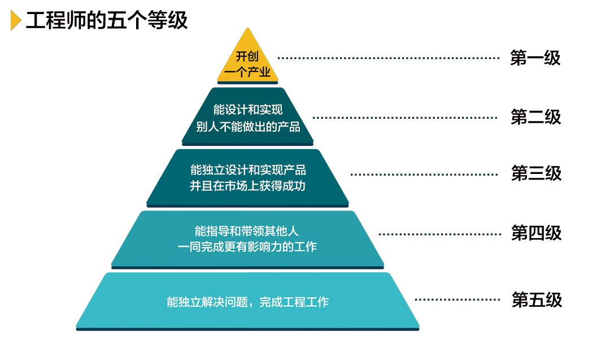

## 从有限的物质世界飞跃到无限的思想空间

如果明天早上你不会醒来，今天你会做些什么呢？

## 不做伪工作者

**愿你在工作之余还能有时间欣赏身边的风景。**

善于找到最重要的工作，并且优先完成它们 —— 为自己的工作列优先级：
- 动脑筋去思考，做什么事情能让公司最大获益，而不是简单应付老板派下来的工作，向老板交差。
- 做什么事情可以提升自身能力？

## 10000小时定律

**智商、10000小时、运气和家庭环境，这些都是成功的必要条件，但没有一个是充分的，甚至加到一起也不充分。**

简单地重复失败是永远走不出失败的怪圈的：若想成功是失败之母，必须从之前的成功和失败中吸取教训。
- CEO的眼界、格局、识人和用人能力，决定着一家公司能否成功。
- 期待一流的团队，对傻逼零容忍（based on公司优秀的人才制度）。

凡事要习惯回过头来三思。
+ 是否我错了，他对了，这一遍思考，一定不能假设自己是对的。
+ 如果还是觉得自己对，对方错，要想是否我的境界不够，不能理解他。

离开自己的舒适区：当一种技能稍微熟悉了，你需要做一件新的有挑战的事情，以便达到下一个目标。

## 人类是否能够长生不老

克隆人的伦理学问题：小明经过克隆，得到小小明，那问题来了，小明的老婆小美，是不是小小明的老婆呢，晚上他们要不要一起睡觉？

所谓长生不老，就是活得长，而且直到生命的最后，依然健康 —— **嗯嗯，健康非常重要，减肥！**

## VR技术与“第三眼美女”

IT新产品获得市场认可必经的三个阶段。
+ 虽然有了一个革命性的发明，产品很性感，但是毛病很多，只有对技术特别敏感的人才会关注和使用。
+ 解决了第一阶段大部分问题，让技术带来的好处充分显现出来，但是价格昂贵，有时还不好伺候，因此只有有钱人才会使用。
+ 解决了价格问题，才能普及到大众。

Product Life Cycle.

## 如何判断技术和产品是否有前景？“黄赌毒开道”

黄、赌、毒是人的最基本需求，哈哈，陌陌、摇一摇、漂流瓶等。人类本能的欲望不会随着素养的提高、受教育程度的增加而消失，只会暂时隐藏起来，或者在权衡利弊后忍痛割爱放弃掉。王欣深谙此道，出狱之后做马桶MT。

黄、赌、毒分别指色情网站、在线赌博和非法交易。

## 说说蚂蚁（小公司）如何战胜大象（大公司）

洋枪洋炮对大刀长矛。
+ 有一个杀手功能，没有杀手锏什么都免谈。
+ **顺势而为**：小蚂蚁的杀手锏必须容易得到当时相关技术的帮助，以至于进步飞快，而传统的产品难以受益于当时的技术进步。

## 从《孙子兵法》和《战争论》说起

**目标的可操作性**在管理公司上的重要性 —— 使成功可以被复制。
+ “重视产品质量” vs. “将程序的单元测试覆盖率由目前的5%，提升到50%”。
+ 为了达到目标，需要具体可操作的步骤，如代码没有单元测试就不能提交，写单元测试超过80%，就给发一笔奖金等等。

目标不仅需要具备可操作性，还要可以被量化，用于判断目标完成的百分比。

## 把公司大小之争变成新旧时代之争

**雄心壮志好青年(候选人) vs. 老奸巨猾大忽悠(小创业公司CEO) —— 星爷篇**

> 大忽悠：公子，你还真识货哎，这么多船，你偏偏挑中我这艘船，我可是出了名的快啊。

> 好青年：是吗？

> 大忽悠：当然啦~

> 好青年：哎呦，卧槽，你的船在下沉嘞~

> 大忽悠：我不是说过咯，沉也沉的快嘛~

如何体现小创业公司的快，尤其是互联网创业公司？ —— 灵活：迅速组织团队，利用各种便捷资源（如开源软件），很快投入到新产品的研发中。

船的龙骨是什么？ —— 使命、愿景和价值观！
+ 在公司成立之初，一定要树立正确的价值导向。**身为软件研发部负责人，刷着论坛，拿着高工资，划水划的飞起，公司竟然能容忍这种人活到现在，搞啥搞，日你仙人板板！**
+ 企业或团队文化成型之前，尽量不要招聘新员工；成型之后，将扩张规模控制在原始团队规模的1/3以内。**卧槽，大姐和小苏在船上凿了个大洞，麻蛋，你们是大疆派过来的间谍吧！**

## 期望值最大化原则和它在生活上的应用

在一个公司里，创始人定下一个什么样的价值观（收益函数），员工就会不自觉地朝着收益最大化的方向努力。
+ Google从小公司开始，给单元测试写得好的员工发奖金，给代码经常出错的员工小惩戒，于是它自然而然地发展成一个重视工程质量的公司。
+ 论坛刷的飞起，APP和测试团队管理的一塌糊涂，工资比我高，还不受任何惩罚，我为啥要努力工作呢？

## 有小聪明没有智慧的人

在未来，制造智能机器的人，其实在利用机器控制其他人。抢月饼这件事，不是机器在和人抢，是有人利用机器在和那些没有使用机器的人抢，“胜负”显而易见。善用机器智能的公司，一定会在竞争中胜出；拒绝机器智能的，一定被淘汰，这是大势所趋。**善用新技术，让自己/组织具备竞争优势。**

勿以恶小而为之，不论大小，恶就是恶。

即便耍小聪明不伤害到公司的利益，也是不要做为好，因为这让一个人变得胸无大志，鼠目寸光。
+ 影响你在别人心目中的看法：公司每天下午的免费水果，汉堡事件，麻蛋，耻辱！

## 西瓜与芝麻

人一旦心态变得非常低，渐渐习惯于非常低的追求，就很难提升自己，让自己走到越来越高的层次上来。

专注于做好一件事/一款产品。
+ 雅虎开发出的互联网服务多得不得了，数都数不过来，但没有一个是世界第一的，很多服务流量和盈利能力非常有限，都是一些小芝麻，最后加起来，还不如Google一个产品带来的收入高。很多公司看到别人挣了钱，自己也要涉足那个行业，最后分到芝麻大一点的市场份额，得不偿失，与其这样，不如把自己的专长发挥好。
+ 一个公司拥有1000款产品，与一款产品拥有1000个功能一样，都是极度低能和不自信的表现。

## 便宜的眼泪

松下幸之助：“任何好的商业都必须是能挣钱的，否则就是对人类的犯罪，因为有限的资源可以用于其他地方。”
+ 我们在做任何事情的时候，都必须明确我们的行为所产生的结果，无论从物质上还是精神上讲都是大于（成本）投入的，否则我们对世界的贡献就是负的。
+ 即便是有良好的动机，也不能为负作用开脱，更何况动机的好坏很难判定。

*从这个角度上来讲，不作为和好心办坏事，都是对世界的犯罪。*

## 关于美国大选答万维钢老师提问

自由 vs. 平等 —— 自由和平等是矛盾的。
+ 如果一个国家是完全自由的，因为人的能力和运气不同，很快就会出现社会分层，不平等了。
+ 如果强调绝对的平等，人就没有了自由。**我的理想是让这个国家不平等，并为之付出努力，这是我的自由。**

莎翁：“倾听别人的意见，但是保留你的判断。”

## 在美国最有钱的人比什么，兼谈美国的慈善文化

钱是为了让孩子做所喜欢的事情，而不是炫富和无所事事的。

## 让你的父母成熟起来

不听老人言，吃亏在眼前？
+ 教育中最可怕的事情就是，用上一辈的思想，教育当下的人，去迎接20年后的未来。
+ 年轻人要让父母理解自己，就要不断将新的思维方式和理念传递给父母。

**建立学习型亲子关系** —— 子女从父母的人生阅历中取其精华，父母学习用新的方式看待世界
+ 父母和子女均可表达对一件事情的观点，以及支持己方观点的论据，但最终选择权归子女，并为自己的选择负责。
+ 无论最终的选择正确与否，均需复盘，从以前的成功和失败中吸取经验和教训。

## 美国私立中学如何教语文和历史

好的教育是能力和素质的教育，通过每一天的课程和课外活动，不知不觉地把好的、适合我们当下社会的**价值观**传递给孩子，同时，让孩子通过知识的学习，掌握分析问题、独立思考和表达自己观点的能力。

吴建民：“软硬都是手段，哪个难？软难。硬，你打我一下我踢你一脚，这个三岁小孩也会，没有难度。讲道理，谈判，软实力，这个很难，首先别人要喜欢你。”

## 担当 —— 走访耶鲁大学随想

人要有自由的思想。
+ 富兰克林：“相信未来，相信年轻人。”
+ 耶鲁是一个向前看的学校，她培养的是未来的领袖，她希望自己的学生按照自己的思想去把握和引领未来，而不希望用老人们的观点禁锢年轻人的思想。因此，即使学校不同意年轻人的做法，也要给他们自由，并且**保护**自己的学生。

**希望你有比我更有见识的想法，我可能会不同意你的观点，但只要你的想法不过激，不太出格，我都会支持你去摸索和尝试。**

**年轻人要有社会的责任感和献身精神。** 在内战期间，耶鲁的一些毕业生回到了自己的故乡 —— 南方各州，当那些州需要有男儿站出来为她战斗时，耶鲁的毕业生应该有这个担当，为自己的故乡战斗，这是大学所鼓励的，即便这些毕业生站到了自己所在州的对立面。

## 像对待家一样对待母校

真正好的教育是：当你离开学校以后，不再需要将（著名）学校的名字挂在嘴边了，因为你的美德和能力说明了一切，否则毕业的一瞬间则是你的人生顶点。

## 硅谷高创会

学什么课不重要，学到什么方法论最重要。
+ 在一个领域中，一个二流的人一辈子再努力，即便在自己的领域里可能也进不了一流的行列。
+ 很多一流的人进入另一个领域常常还是一流，这里的差距不在于智力和努力程度，而在于做事情的思想方法。

*一名傻缺高级项目管理总监，也不会是一名优秀的清洁工。*

## 巴菲特午餐都聊些什么

不要做自己不懂的事情。
+ 不做自己不熟悉的事情，只是不做当下自己不熟悉的，并非永远不打算熟悉那些事情 —— 巴菲特对英特尔、IBM和苹果的投资。
+ 对于大部分人来讲最好的投资是自己的工作和事业，因为你擅长于此。

**智慧大战之步步高篇** —— 步步高每年投入几十亿做广告，让广告公司挣得盆满钵满

> 步步高高管团队：小平童鞋啊，咱们可以自己创办广告公司呀，或者收购一个，自己搞，别便宜了那帮畜生啊~

> 段永平：你们这帮脑残，你们懂做广告吗，劳资都不懂，你们多啥？

> 步步高高管团队：别怂啊，老铁，你怎么就知道特么我们搞不好，我们现在不懂，但是可以学啊。

> 段永平：学你妹夫，如果你们的狗屁逻辑是对的，那现在世界上最大的广告公司一定是可口可乐广告公司和宝洁广告公司，我们还用得着去CCAV做广告吗？一群傻逼，给劳资爬~

巴菲特认为，懂得投资艺术的人非常少。用巴菲特的这种思路梳理一下自己周围的小伙伴们，发现真特么正确，无论是懂得产品艺术、营销艺术还是管理艺术的人，都是极少数。**就凭这一群无耻之徒，有功就抢，有锅就甩，为啥你认为可以同时做好云台相机和无线摄像头？**

## 这个世界没有欠你什么

不要指望通过十年寒窗苦读就一下子翻身，醒醒，兄弟，想啥呢，现实点好伐。
+ 社会竞争是一种非常复杂的长期系统性动员，寒窗苦读只是成功的因素之一，钱多、智商高、读书强、父母好、长得美都是其中的一个变量而已，命运是多个变量互动的结果。
+ 不要因为自己很努力，就特么觉着别人不努力。**小聪聪家境好吧，可以混吃等死吧，别人读书的时候也是很努力的好伐~**
+ 在任何国家，历朝历代，社会都是分层的。稍微好一点的社会，不过是有一个上下层之间的通道，让人员可以流动而已。*认清这个残酷的现实，才有一点点希望，感谢伟大的互联网吧，骚年们！*
+ 对于那些试图在金字塔上爬几个台阶的人来讲，重要的不是抱怨社会的不公平（社会本来就不公平），而是付出足够的努力，同时把注意力放到最应该关注的事情上去。

啥叫公平？麻痹的，劳资天天努力工作，读书旅行提升自己，用正确的价值观养育子女；你麻痹的整天刷论坛，想着溜须拍马和甩锅，劳资儿子凭啥和你儿子一样的待遇？想啥呢？

## 帝道、王道与霸道，兼谈博雅教育

**欲速则不达 —— 不要试图用短期的方法，达成长期的目标。**

但凡能够比较长期稳定挣钱的行业，开始的投入都是比较大的，并不存在一种不需要投入就能获得很高回报的行业（达内？），否则，这个行业一定太挤（谁傻啊，培训3个月，月薪过万，阿猫阿狗都来了，傻逼都能做项目经理，对吧？！），以至于一段时间后行业的回报会急剧下降。

## 引擎和刹车

在一个和谐的社会里，有动力的人应该成为引擎，有经验的人应该成为刹车。 —— **在一家公司里，谁应该扮演引擎，谁又应该扮演刹车呢？**

CMU的一个毕业生在毕业典礼上问主讲嘉宾盖茨，下一个像微软这样的机会在哪里？盖茨说，这是我该问你的问题。像盖茨这样的智者，很清楚什么事情不能做，但是他希望年轻人提出什么事情能做，这样才能突破老一代的思维局限性。
+ 盖茨的内心活动：麻痹的，你问的是个锤子，劳资要是知道，早去干了，还跟你在这儿哔哔~

## 五级工程师和职业发展

人和人的差距，能力和能力的差距，是数量级的差别，而不是通常人们想象的差一点点。

第三级的工程师 = 第四级工程师 + 对市场的判断力 + 营销能力 + 产品能力 + ...。**我能算是一名合格的第四级工程师吗？**

## 智能时代的产业特点

共享经济：滴滴或Airbnb vs. 上门洗脚、理发。
+ 滴滴和Airbnb通过互联网把更多的（闲置）资源引入了市场，让大家共享。
+ 上门洗脚则不同，不能因为有了共享经济的概念就多出了几倍的洗脚妹，有闲暇时间的人一般也不可能端着个盆给人上门洗脚。原来是多少资源还是多少资源，所谓搞分享经济的公司，无非是再扒一层皮而已。
